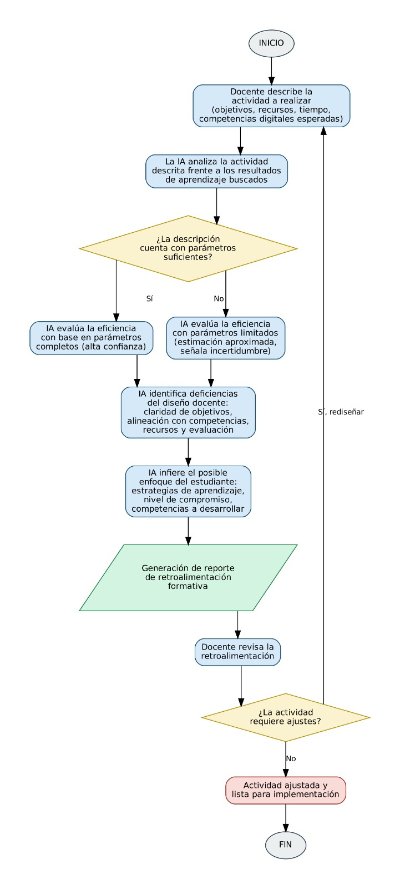

Hagamos un diagrama de flujo sobre evaluación formativa de competencias digitales Asistida por IA. El docente describe una actividad que va a realizar pero el analiza a través de esta herramienta cuan completa es para obtener los resultados que se buscan. La IA evalúa la eficiencia aunque no tenga muchos parámetros. Evalua las deficiencias del profesor y el posible enfoque del estudiante
